# world-precipitation-cog-map

[](https://github.com/mapion/world-precipitation-cog-map/actions/workflows/deploy.yml)

世界降水マップのCOG版


## Architecture



## Requirements

Node.js 18 以上

## Development

> 以下はローカルマシンでの開発方法だが、Codespacesにも対応している

ソースコードをローカルにcloneする

```sh
git clone https://github.com/mapion/world-precipitation-cog-map.git
```

リポジトリのディレクトリに移動

```sh
cd world-precipitation-cog-map
```

インストール

```sh
npm install
```

実行

```sh
npm run dev
open http://localhost:3000
```

## Contributing

1. Forkする

2. コード修正

    ```sh
    vi index.html
    vi src/main.ts
    ```

3. ビルドテスト

    ```sh
    npm run build
    ```

4. ビルドプレビュー

    ```sh
    npm run preview
    open http://localhost:4173
    ```

5. プッシュ

    ```sh
    git add .
    git commit -m "Update"
    git push origin feature/xxx
    ```

6. プルリク作成

## Release

1. プルリクに対してレビューを実施
2. プルリクをmainブランチにマージ

    - Actionsが走り自動でGitHub Pagesにデプロイされる

3. タグ作成

    ```sh
    git checkout main
    git pull origin main
    git tag v1.0.0
    git push origin v1.0.0
    ```

4. GitHub上でリリースを作成

    - タグを選択
    - `Create release from tag`を押下
    - `Genarate release notes`を押下
    - `Publish release`を押下

## License

[MIT License](LICENSE)
